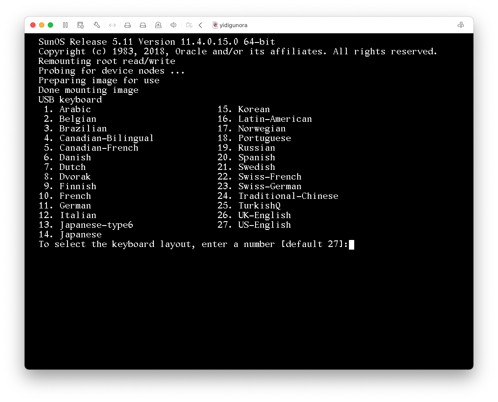
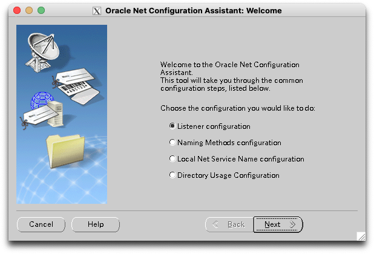
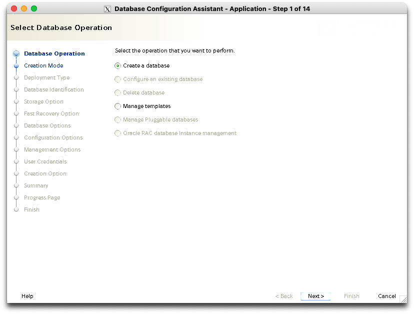

# Solaris (x86_64) + Oracle 19c 설치

## 개요

### 목표

* 개발 테스트/학습용 오라클 데이터베이스 구축
* Solaris 환경에서 오라클 데이터베이스 설치

### Hardware (VM)

* **Host OS**: macOS Sequoia 15.0.1
* **Hypervisor**: VMware Fusion 13.6.1
* **VM settings**
    * **OS Type**: Solaris 11 64-bit
    * **CPU**: 2 Core
    * **RAM**: 3 GiB (6 GiB for install time)
* **Virtual Disk**
    * **Root Disk**: 20 GiB (SCSI c2t0d0)
    * **Oracle Disk**: 20 GiB (SCSI c2t1d0)

### Software

* **Solaris 11.4.42 CBE** (x86)
    * [Oracle Solaris Downloads](https://www.oracle.com/kr/solaris/solaris11/downloads/solaris-downloads.html)
* **Oracle Database 19c EE** (solaris x86_64)
    * [Oracle Database 19c (19.5.0.0.0)](https://www.oracle.com/database/technologies/oracle19c-solarisx86-1950000-downloads.html)

### 참고 자료

* [Database Installation Guide for Oracle Solaris](https://docs.oracle.com/en/database/oracle/oracle-database/19/ssdbi/index.html)
* [Solaris 11.4.42 설치 - 윈디하나의 솔라나라](https://www.solanara.net/solanara/solaris11inst)
* [솔라리스(Solaris x86)11.4 - Oracle DB 19C(19.5) 설치](https://blog.naver.com/swseo1/222095098709)

## Solaris 설치

### Solaris 11.4.42 CBE 설치 방법

* 현재 최신 버전은 11.4.42 CBE
* 11.4.42 CBE iso 파일(V1019840-01.iso)을 다운로드 가능하지만 iso로 설치하는 것은 실패함. 11.4 iso(sol-11_4-text-x86.iso)로 설치 이후 업그레이드 방법 사용

### Solaris 11.4 설치

iso 파일을 이용해서 부팅 후 설치를 진행한다.



#### [Solaris 11.4 설치 자세히 보기](docs/solaris11-install.md)

### `ssh` 접속 설정

`solaris-desktop` 패키지를 설치하면 GNOME 데스크탑 환경에서 작업을 진행할 수 있지만 설치하지 않고 진행할 예정이다.

* `solaris-desktop`에서는 한글 표시는 되지만 입력이 뭔가 원활하지 않았음
* GNOME 데스크탑의 기능도 그다지 좋지 않음 (리눅스 대비 불편함)
* 무엇보다 Solaris 게스트는 VMware의 3D가속이 지원되지 않으므로 매우 느림

Solaris 콘솔 화면에서는 한글도 제대로 표시되지 않으므로 `ssh`를 이용해서 설정 및 이후 설치를 진행할 예정이다.

`ssh -X` 또는 `ssh -Y`는 X window 커넥션을 ssh 터널을 통해서 호스트 컴퓨터로 포워딩 하도록 설정한다. 오라클 데이터베이스 설치 과정에서 X윈도우가 필요하므로 `ssh -Y`를 사용할 것이다.

이렇게 진행하려면 X윈도우 서버를 따로 준비해야 한다.

* macOS에서는 [XQuartz](https://www.xquartz.org/)를 설치하면 가능
* 리눅스가 설치된 PC나 누구나 냉장고에 한두개 정도는 설치해 놓는 리눅스 VM 이용
* Windows에서는 [X manager](https://www.netsarang.com/ko/xmanager-download/)로 X 서버 실행 (유료 프로그램이고 30일 트라이얼 이용 가능하긴 하나 비추)

X 서버를 사용하기 마땅치 않다면 CBE 업그레이드 이후 `solaris-desktop`을 설치한다.

<details>
    <summary>`ssh` 접속 과정 자세히 보기</summary>

* `yidigun`이 호스트 PC(macOS)이고, `yidigunora`가 solaris VM임
* 호스트의 `hosts`파일에 `yidigunora`를 등록해 놓은 상태임
* `ssh-keygen`으로 키 파일을 먼저 생성한 상태임
* `ssh -Y`로 접속해서 `$DISPLAY` 변수가 설정되어 있음

```
dagui@yidigun:~]$ ssh-keygen
...  중략 ...
dagui@yidigun:~]$ ls .ssh/id_rsa*
.ssh/id_rsa  .ssh/id_rsa.pub
dagui@yidigun:~]$ grep yidigunora /etc/hosts
172.16.124.11  yidigunora
dagui@yidigun:~]$ ssh-copy-id yidigunora
/opt/local/bin/ssh-copy-id: INFO: Source of key(s) to be installed: "/Users/dagui/.ssh/id_rsa.pub"
The authenticity of host 'yidigunora (172.16.124.11)' can't be established.
ED25519 key fingerprint is SHA256:2AAbDplonqz7aFCdSBAov4jvTRL850dQApZMiVXgB1s.
This key is not known by any other names.
Are you sure you want to continue connecting (yes/no/[fingerprint])? yes
/opt/local/bin/ssh-copy-id: INFO: attempting to log in with the new key(s), to filter out any that are already installed
/opt/local/bin/ssh-copy-id: INFO: 1 key(s) remain to be installed -- if you are prompted now it is to install the new keys
(dagui@yidigunora) Password: 

Number of key(s) added: 1

Now try logging into the machine, with: "ssh 'yidigunora'"
and check to make sure that only the key(s) you wanted were added.

dagui@yidigun:~]$ ssh -Y yidigunora
Last login: Fri Nov 15 02:16:07 2024 from 172.16.124.1
Oracle Corporation      SunOS 5.11      11.4    Aug 2018
dagui@yidigunora:~]$ echo $DISPLAY
localhost:11.0
dagui@yidigunora:~]$ 
```
</details>

### 제일 먼저 설정할 것 - `hostname`과 `/etc/hosts`

| ***호스트명으로 IP조회가 가능해야 한다.***

이것은 오라클 DB뿐만 아니라 여러 네트워크 서비스에서 영향을 많이 미치므로 무조건 맨 처음 확인하는게 좋다.
IP를 수동 설정했으니 `/etc/hosts` 파일에 호스트 항목이 추가되어있다. 만약 DHCP로 설정했다면 `hosts`파일을 직접 수정해 줘야 한다.

```
dagui@yidigunora:~]$ hostname
yidigunora
dagui@yidigunora:~]$ host yidigunora
yidigunora.localdomain has address 172.16.124.11
yidigunora.localdomain has address 172.16.124.11
Host yidigunora.localdomain not found: 3(NXDOMAIN)
dagui@yidigunora:~]$ 
```

#### /etc/hosts

```
#
# Copyright 2009 Sun Microsystems, Inc.  All rights reserved.
# Use is subject to license terms.
#
# Internet host table
#
::1             localhost
127.0.0.1       localhost loghost
172.16.124.11   yidigunora
```

### Solaris 11.4.42 CBE로 업그레이드

업그레이드 할때는 설치할 패키지가 매우 많으므로 Boot Environment 기능을 이용해서 스냅샷을 만들고 진행한다.

```sh
sudo beadm create -d "Solaris 11.4.42 CBE" sol-11_4_42-cbe
sudo beadm mount sol-11_4_42-cbe /mnt
sudo pkg -R /mnt update --accept
sudo beadm umount sol-11_4_42-cbe
sudo beadm activate sol-11_4_42-cbe
```

<details>
  <summary>진행과정 자세히 보기</summary>

```
dagui@yidigunora:~]$ beadm list
BE 이름 플래그 마운트 지점 공간 정책 만든 날짜    
--------- --------- ---------------- ------ ------ ---------------- 
solaris   NR        /                3.00G  static 2024-11-15 01:20 
dagui@yidigunora:~]$ sudo beadm create -d "Solaris 11.4.42 CBE" sol-11_4_42-cbe
dagui@yidigunora:~]$ sudo beadm mount sol-11_4_42-cbe /mnt
dagui@yidigunora:~]$ beadm list
BE 이름       플래그 마운트 지점 공간  정책 만든 날짜    
--------------- --------- ---------------- ------- ------ ---------------- 
sol-11_4_42-cbe -         /mnt             209.55M static 2024-11-15 02:37 
solaris         NR        /                3.00G   static 2024-11-15 01:20 
dagui@yidigunora:~]$ sudo pkg -R /mnt update --accept
------------------------------------------------------------
패키지: pkg://solaris/release/notices@11.4-11.4.42.0.0.111.0:20211203T164329Z
사용권: lic_pre-GA

PLEASE SCROLL DOWN AND READ ALL OF THE FOLLOWING TERMS AND CONDITIONS CAREFULLY

This Oracle Solaris product is pre-GA (beta) Oracle Solaris software and is
... 중략 ...
download or access this pre-GA Oracle Solaris software.

      제거할 패키지:  94
      설치할 패키지: 125
   업데이트할 패키지: 543
      변경할 패키지:   1
      변경할 조정자:   8
      변경할 서비스:  27

릴리스 노트:
... 중략 ...

다운로드                       패키지        파일     XFER(MB)  속도
완료됨                     763/763   53975/53975  817.6/817.6  597k/s

단계                             항목
이전 작업 제거                     30781/30781
새 작업 설치                       39453/39453
수정된 작업 업데이트                 44202/44202
패키지 상태 데이터베이스 업데이트       완료 
패키지 캐시 업데이트                 637/637 
이미지 상태 업데이트                 완료 
빠른 조회 데이터베이스 만들기          완료 
패키지 캐시 업데이트                 1/1 
dagui@yidigunora:~]$ beadm list
BE 이름       플래그 마운트 지점 공간 정책 만든 날짜    
--------------- --------- ---------------- ------ ------ ---------------- 
sol-11_4_42-cbe R         -                5.91G  static 2024-11-15 02:37 
solaris         N         /                64.38M static 2024-11-15 01:20 
dagui@yidigunora:~]$ zfs list
NAME                               USED  AVAIL  REFER  MOUNTPOINT
rpool                             11.0G  8.31G  4.31M  /rpool
rpool/ROOT                        5.97G  8.31G    31K  none
rpool/ROOT/sol-11_4_42-cbe        5.96G  8.31G  3.27G  /
rpool/ROOT/sol-11_4_42-cbe/var     555M  8.31G   249M  /var
rpool/ROOT/solaris                4.99M  8.31G  2.63G  /
rpool/ROOT/solaris/var             126K  8.31G   315M  /var
rpool/VARSHARE                    31.8M  8.31G  2.74M  /var/share
rpool/VARSHARE/kvol               27.7M  8.31G    31K  /var/share/kvol
rpool/VARSHARE/kvol/dump_summary  1.22M  8.31G  1.02M  -
rpool/VARSHARE/kvol/ereports      10.2M  8.31G  10.0M  -
rpool/VARSHARE/kvol/kernel_log    16.2M  8.31G  16.0M  -
rpool/VARSHARE/pkg                  63K  8.31G    32K  /var/share/pkg
rpool/VARSHARE/pkg/repositories     31K  8.31G    31K  /var/share/pkg/repositories
rpool/VARSHARE/sstore             1.14M  8.31G  1.14M  /var/share/sstore/repo
rpool/VARSHARE/tmp                  31K  8.31G    31K  /var/tmp
rpool/VARSHARE/zones                31K  8.31G    31K  /system/zones
rpool/dump                        3.00G  8.31G  3.00G  -
rpool/export                       100K  8.31G    32K  /export
rpool/export/home                   68K  8.31G    32K  /export/home
rpool/export/home/dagui             36K  8.31G    36K  /export/home/dagui
rpool/swap                        2.00G  8.31G  2.00G  -
dagui@yidigunora:~]$ sudo shutdown -i6 -g0 -y

Shutdown started.    2024년 11월 15일 금요일 오전  3시 22분 04초 KST

Changing to init state 6 - please wait
Broadcast Message from root (pts/1) on yidigunora 금 11월 15 03:22:...
THE SYSTEM yidigunora IS BEING SHUT DOWN NOW ! ! !
Log off now or risk your files being damaged

dagui@yidigunora:~]$ 
```
</details>

업그레이드가 완료하면 재부팅한다.

```sh
sudo shutdown -i6 -g0 -y
```

재부팅 되면 부트로더에 "Solaris 11.4.42 CBE"가 추가되어있다.


부팅이 성공적으로 되었다면 기존 스냅샷은 삭제한다.

```sh
sudo beadm destroy solaris
```

<details>
    <summary>진행 과정 자세히 보기</summary>

```
dagui@yidigunora:~]$ sudo beadm destroy solaris
be://rpool/solaris을(를) 삭제하겠습니까? 이 작업은 실행을 취소할 수 없습니다. [y|N]: y
dagui@yidigunora:~]$ beadm list
BE 이름             플래그       마운트 지점           공간      정책       만든 날짜                
--------------- ------ ----------- ----- ------ ---------------- 
sol-11_4_42-cbe NR     /           5.96G static 2024-11-15 02:37 
```
</details>


### 잡다한 설정 (선택)

* 편의 설정은 `root`나 `/etc/skel`(신규 사용자 생성시 템플릿)에도 같이 설정해주는 센스

#### `vim` 화살표 키 가능하도록

* macOS 에서만 그런 것일 수 있는데, `vim` 입력 모드에서 화살표 키가 동작하지 않는 문제가 있어서 `.vimrc` 를 생성해 주었다.

```sh
echo "set nocompatible" >>~/.vimrc
for vimrc in ~root/.vimrc /etc/skel/.vimrc; do
    echo "set nocompatible" | sudo tee -a $vimrc >/dev/null
done
```

#### [`/etc/profile.d` 설정](etc/profile.fragment)

향후 설정 편의를 위해서 `/etc/profile.d`를 로딩하도록 설정 했다.

```sh
sudo mkdir /etc/profile.d
cat <<EOF | sudo tee -a /etc/profile >/dev/null

# source /etc/profile.d/*.sh
export PATH=/usr/bin
if [ `id -g` -eq 10 ]; then # group staff
    PATH=\$PATH:/usr/sbin
fi
if [ -d /etc/profile.d ]; then
    for sh in /etc/profile.d/*.sh; do
        . \$sh
    done
fi
EOF
```

##### [`/etc/profile.d/console-lang.sh`](etc/profile.d/console-lang.sh)

* 콘솔에서 접속할때는 영문 설정을 사용하도록 함

```sh
if [ `tty` = "/dev/console" ]; then
    export LANG=en_US.UTF-8
fi
```

##### [`/etc/profile.d/usr-local.sh`](etc/profile.d/usr-local.sh)

```sh
if [ -d /usr/local/bin ]; then
    PATH=$PATH:/usr/local/bin
fi
if [ -d /usr/local/sbin -a `id -g` -eq 10 ]; then
    PATH=$PATH:/usr/local/sbin
fi
```

#### `~/.profile`의 `$PATH` 설정 삭제

* 사용자 로그인 설정(~/.profile)에 `$PATH` 변수를 강제 설정하도록 되어있다. `/etc/profile.d/*.sh`에서 설정이 적용 되도록 지워주었다.
* `root`의 `$PATH`는 관습상 민감하게 관리해야 하므로 건드리지 않는다.

```sh
gsed -i -e 's/^export PATH/#export PATH/' ~/.profile
sudo gsed -i -e 's/^export PATH/#export PATH/' /etc/skel/.profile
```

### 추가 S/W 설치 - Solaris Desktop (선택)

데스크탑을 사용하고자 한다면 설치한다.   
(오라클 데이터베이스 설치를 위해서는 X윈도우가 필요하므로 다른 X서버가 없다면 설치해야 한다.)

```sh
sudo pkg install solaris-desktop

# 추가 한글 글꼴 설치는 선택
sudo pkg install hanyang-ko unfonts-ko-core unfonts-ko-extra
```

<details>
    <summary>진행 과정 자세히 보기</summary>

```
dagui@yidigunora:~]$ sudo pkg install solaris-desktop
     설치할 패키지: 281
     변경할 조정자:   1
     변경할 서비스:  13
   부트 환경 만들기: 아니오
백업 부트 환경 만들기: 아니오

다운로드                                패키지            파일     XFER(MB)      속도
완료됨                                  281/281   62165/62165  853.5/853.5  636k/s

단계                                   항목
새 작업 설치                             77122/77122
패키지 상태 데이터베이스 업데이트             완료 
패키지 캐시 업데이트                       0/0 
이미지 상태 업데이트                       완료 
빠른 조회 데이터베이스 만들기                완료 
패키지 캐시 업데이트                       1/1 
dagui@yidigunora:~]$ sudo pkg install hanyang-ko unfonts-ko-core unfonts-ko-extra
     설치할 패키지:   3
     변경할 서비스:   1
   부트 환경 만들기: 아니오
백업 부트 환경 만들기: 아니오

다운로드                                 패키지            파일     XFER(MB)      속도
완료됨                                  3/3         47/47    63.1/63.1  2.3M/s

단계                                    항목
새 작업 설치                              93/93
패키지 상태 데이터베이스 업데이트               완료 
패키지 캐시 업데이트                        0/0 
이미지 상태 업데이트                        완료 
빠른 조회 데이터베이스 만들기                  완료 
패키지 캐시 업데이트                        1/1 
```
</details>

#### 데스크탑을 필요할 때만 사용하려면

`gdm` 서비스를 중지해 놓으면 데스크탑을 평소에는 텍스트 콘솔을 사용하다가 필요할때만 X윈도우를 사용할 수 있다.

```sh
sudo svcadm disable gdm
```

X 윈도우가 필요할 경우(오라클 설치라던가) 콘솔에서 다음과 같이 띄울 수 있다.

```sh
LANG=ko_KR.UTF-8 startx
```

### 추가 S/W 설치 - 컴파일러와 개발자 도구 (선택)

* 참고 링크: https://www.solanara.net/solanara/solaris11#head_solaris11_conf_compiler

컴파일러와 개발자 도구를 설치하고자 한다면 Oracle Developer Studio 와 GNU gcc를 선택할 수 있다.
Oracle이 제공하는 컴파일러와 Developer Studio를 사용해보기로 했다.

Developer Studio를 설치하려면 Oracle에 가입해서 인증서를 발급받아야 한다.

https://pkg-register.oracle.com/

키 파일(`pkg.oracle.com.key.pem`)과 인증서 파일(`pkg.oracle.com.certificate.pem`)을 준비한다.

```sh
sudo pkg change-facet --no-backup-be \
    facet.version-lock.consolidation/sunpro/sunpro-incorporation=false
sudo pkg update sunpro-incorporation
sudo pkg set-publisher \
    -k ~/pkg.oracle.com.key.pem \
    -c ~/pkg.oracle.com.certificate.pem \
    -G '*' -g https://pkg.oracle.com/solarisstudio/release solarisstudio
sudo pkg install --accept developer-studio-utilities developerstudio-126
```

<details>
    <summary>진행 과정 자세히 보기</summary>

```
dagui@yidigun:~]$ scp /Volumes/DAT/solaris/*.pem yidigunora:
pkg.oracle.com.certificate.pem          100% 1099     1.1MB/s   00:00    
pkg.oracle.com.key.pem                  100% 1675     1.6MB/s   00:00    
dagui@yidigun:~]$ ssh yidigunora
Last login: Fri Nov 15 03:43:35 2024 from 172.16.124.1
Oracle Solaris 11.4.42.111.0                  Assembled December 2021
dagui@yidigunora:~]$ sudo pkg change-facet --no-backup-be \
    facet.version-lock.consolidation/sunpro/sunpro-incorporation=false
     변경할 패키지:   1
  변경할 변형/페이싯:   1
   부트 환경 만들기: 아니오
백업 부트 환경 만들기: 아니오

단계                                                항목
이전 작업 제거                                         1/1
패키지 상태 데이터베이스 업데이트                           완료 
패키지 캐시 업데이트                                     0/0 
이미지 상태 업데이트                                     완료 
빠른 조회 데이터베이스 만들기                              완료 
패키지 캐시 업데이트                                     1/1 
dagui@yidigunora:~]$ sudo pkg update sunpro-incorporation
이 이미지에 사용 가능한 업데이트가 없습니다.
dagui@yidigunora:~]$ sudo pkg set-publisher \
    -k ~/pkg.oracle.com.key.pem \
    -c ~/pkg.oracle.com.certificate.pem \
    -G '*' -g https://pkg.oracle.com/solarisstudio/release solarisstudio
dagui@yidigunora:~]$ sudo pkg install --accept developer-studio-utilities developerstudio-126
------------------------------------------------------------
패키지: pkg://solarisstudio/developer/developerstudio-126/studio-legal@12.6-1.0.0.1:20170815T160721Z
사용권: devpro.OTN.license

You acknowledge that your use of Oracle Developer Studio is subject to the Oracle Developer Studio OTN License Agreement.  The OTN License Agreement is located at : http://www.oracle.com/technetwork/licenses/studio-license-2980206.html

     설치할 패키지:  36
   부트 환경 만들기: 아니오
백업 부트 환경 만들기: 아니오

다운로드                                  패키지            파일     XFER(MB)      속도
완료됨                                    36/36   11211/11211  575.0/575.0  1.7M/s

단계                                     항목
새 작업 설치                               19629/19629
패키지 상태 데이터베이스 업데이트               완료 
패키지 캐시 업데이트                         0/0 
이미지 상태 업데이트                         완료 
빠른 조회 데이터베이스 만들기                  완료 
패키지 캐시 업데이트                         2/2 
```
</details>

#### [`/etc/profile.d/developerstudio.sh`](etc/profile.d/developerstudio.sh)

* 개발자 도구를 `$PATH`에 추가

```sh
DEVTOOLS=/opt/developerstudio12.6
PATH=$PATH:$DEVTOOLS/bin
export PATH DEVTOOLS
```

#### 컴파일러 테스트

* [GNU hello](https://www.gnu.org/software/hello/)를 다운 받아 컴파일 해보자

```sh
wget https://ftp.gnu.org/gnu/hello/hello-2.12.tar.gz
gtar zxf hello-2.12.tar.gz
cd hello-2.12
./configure
make
./hello
```

<details>
    <summary>자세히 보기</summary>

```
dagui@yidigunora:~]$ wget https://ftp.gnu.org/gnu/hello/hello-2.12.tar.gz
--2024-11-15 03:57:12--  https://ftp.gnu.org/gnu/hello/hello-2.12.tar.gz
Resolving ftp.gnu.org (ftp.gnu.org)... 209.51.188.20, 2001:470:142:3::b
Connecting to ftp.gnu.org (ftp.gnu.org)|209.51.188.20|:443... connected.
HTTP request sent, awaiting response... 200 OK
Length: 1017723 (994K) [application/x-gzip]
Saving to: ‘hello-2.12.tar.gz’

hello-2.12.tar.gz       100%[============================>] 993.87K  72.1KB/s    in 13s     

2024-11-15 03:57:27 (76.6 KB/s) - ‘hello-2.12.tar.gz’ saved [1017723/1017723]

dagui@yidigunora:~]$ gtar zxf hello-2.12.tar.gz 
dagui@yidigunora:~]$ cd hello-2.12
dagui@yidigunora:~/hello-2.12]$ ls
ABOUT-NLS     ChangeLog.O   contrib       INSTALL       Makefile.in   README-dev
aclocal.m4    config.in     COPYING       lib           man           src
AUTHORS       config.log    doc           m4            NEWS          tests
build-aux     configure     GNUmakefile   maint.mk      po            THANKS
ChangeLog     configure.ac  hello.1       Makefile.am   README        TODO
dagui@yidigunora:~/hello-2.12]$ ./configure
checking for a BSD-compatible install... /usr/bin/ginstall -c
checking whether build environment is sane... yes
checking for a thread-safe mkdir -p... /usr/bin/gmkdir -p
checking for gawk... gawk
checking whether make sets $(MAKE)... yes
checking whether make supports nested variables... yes
checking for gcc... no
checking for cc... cc
checking whether the C compiler works... yes
checking for C compiler default output file name... a.out
checking for suffix of executables... 
checking whether we are cross compiling... no
checking for suffix of object files... o
checking whether we are using the GNU C compiler... no
checking whether cc accepts -g... yes
checking for cc option to enable C11 features... none needed
checking whether the compiler is clang... no
checking for compiler option needed when checking for declarations... none
checking whether make supports the include directive... yes (GNU style)
checking dependency style of cc... none
checking how to run the C preprocessor... cc -E
... 중략 ...
cc  -g   -o hello src/hello.o  ./lib/libhello.a 
dagui@yidigunora:~/hello-2.12]$ ./hello --help
Usage: ./hello [OPTION]...
Print a friendly, customizable greeting.

  -t, --traditional       use traditional greeting
  -g, --greeting=TEXT     use TEXT as the greeting message

      --help     display this help and exit
      --version  output version information and exit

Report bugs to: bug-hello@gnu.org
GNU Hello home page: <https://www.gnu.org/software/hello/>
General help using GNU software: <https://www.gnu.org/gethelp/>
Report GNU Hello translation bugs to <https://translationproject.org/team/>
dagui@yidigunora:~/hello-2.12]$ ./hello
Hello, world!
dagui@yidigunora:~/hello-2.12]$ ./hello -g "Hello, Solaris"
Hello, Solaris
dagui@yidigunora:~/hello-2.12]$ 
```
</details>


## Oracle Database 설치

### 설치 작업 계획

`oracle` 계정에 `sudo` 권한을 안주고 시스템 설치시 생성한 사용자를 사용할 예정

* `sudo`로 실행
    * 사용자/그룹 생성
    * S/W 요구사항 설치
    * ZFS pool 및 데이터셋 생성
    * 디렉토리 구조 생성 및 퍼미션 설정
* `oracle` 사용자 실행
    * 설치 파일 압축 해제
    * Universal Installer 실행 (X 윈도우 필요)
    * Listener 생성 (X 윈도우 필요)
    * Database 생성 (X 윈도우 필요)
    * 각종 설정 파일 수정
    * Sample Schema 생성
* `sudo`로 실행
    * init script 작성 및 서비스 설정
* 시스템 종료 및 RAM 설정 변경

#### RAM 용량

VM 생성시 RAM을 6 GiB로 설정했으나 이는 설치 과정에서 메모리 부족 오류를 방지하기 위한 것으로
최종 실행 환경에서는 3 GiB로 운영할 예정이다.   
따라서 데이터베이스 생성 시점에 memory target을 3 GiB에 맞춰서 생성해줘야 한다.

#### 디렉토리 구조

원래 오라클 권장사항은 별도로 마운트한 디스크(`/u01/app`)를 준비하고,
그 하위에 `ORACLE_BASE`와 `oraInventory`가 위치하는 것이다.

그렇지만 ZFS를 사용할 예정이고 너무 번거로우므로 아래와 같이 설정할 계획

* **설치 디스크**: ZFS `orapool`
* **`oraInventory`**: ZFS `orapool/inventory` -> `/etc/oracle/oraInventory`
* **`ORACLE_BASE`**: ZFS `orapool/base` -> `/opt/oracle`
* **`ORACLE_HOME`**: ZFS `orapool/dbhome19c` -> `$ORACLE_BASE/product/19.5/dbhome_1`
* **Data Directory**: ZFS `orapool/oradata` -> `$ORACLE_BASE/oradata`
* **Fast recovery area**: ZFS `orapool/recovery` -> `$ORACLE_BASE/fast_recovery_area`

### 사용자와 그룹 생성

#### 사용자 그룹

* OINSTALL: `oinstall` (오라클 제품 설치, 반드시 소유자의 기본 그룹이 되어야함)
* OSDBA: `dba` (사용자 관리 및 데이터베이스 관리 권한)
* OSOPER: `dba` (데이터베이스 시작/종료)
* OSBACKUPDBA, OSDGDBA, OSRACDBA, and OSKMDBA: 기타 롤 그룹들도 모두 `dba` 하나로 퉁 친다

```sh
sudo groupadd oinstall
sudo groupadd dba
```

#### 사용자

* 설치 관리자: `oracle`
* OSDBA user: `oracle`

```sh
sudo useradd -g oinstall -G dba -m oracle
sudo passwd oracle
sudo projadd -U oracle -K "project.max-shm-memory=(priv,4g,deny)" user.oracle
```

<details>
    <summary>진행 상황 자세히 보기</summary>

```
dagui@yidigunora:~]$ sudo groupadd oinstall
dagui@yidigunora:~]$ sudo groupadd dba
dagui@yidigunora:~]$ sudo useradd -g oinstall -G dba -m oracle
96 blocks
dagui@yidigunora:~]$ sudo passwd oracle
New Password: 
Re-enter new Password: 
passwd: password successfully changed for oracle
dagui@yidigunora:~]$ sudo projadd -U oracle -K "project.max-shm-memory=(priv,4g,deny)" user.oracle
dagui@yidigunora:~]$ 
```
</details>

### S/W 요구사항 설치

설치에 필요한 S/W 들은 `oracle-database-preinstall-19c` 그룹 패키지를 설치하면 된다.

```sh
sudo pkg install oracle-database-preinstall-19c
```

<details>
    <summary>진행 상황 자세히 보기</summary>

```
dagui@yidigunora:~]$ sudo pkg install oracle-database-preinstall-19c
     설치할 패키지:  17
     변경할 조정자:   1
     변경할 서비스:   4
   부트 환경 만들기: 아니오
백업 부트 환경 만들기: 아니오

다운로드                               패키지            파일     XFER(MB)      속도
완료됨                                 17/17       326/326  171.4/171.4  3.0M/s

단계                                  항목
새 작업 설치                            716/716
패키지 상태 데이터베이스 업데이트             완료 
패키지 캐시 업데이트                      0/0 
이미지 상태 업데이트                      완료 
빠른 조회 데이터베이스 만들기                완료 
패키지 캐시 업데이트                      1/1 
```
</details>

### 디스크 용량 요구사항

* 디스크 용량 요구사항: 엔터프라이즈 에디션 최소 8.1 GB
* Swap 공간: RAM 크기에 따라 다름
    * 1 ~ 2 GiB: 1.5 * RAM 크기
    * 2 ~ 16 GiB: RAM 크기와 동일
    * 16 GiB 이상: 16 GiB
* `/tmp` 용량: 1 GiB 이상

3 GiB 로 운영할 예정이므로 swap 공간을 3 GiB 로 설정해 준다. `tmpfs`는 swap 공간을 공유한다. 따라서 충분할 것임

```
dagui@yidigunora:~]$ df -kh /tmp
Filesystem             Size   Used  Available Capacity  Mounted on
swap                  5.99G     4K      5.99G     1%    /tmp
```

ZFS 에서 swap 크기 설정

```sh
sudo zfs set volsize=3g rpool/swap
```

<details>
    <summary>진행 상황 자세히 보기</summary>

```
dagui@yidigunora:~]$ zfs get volsize rpool/swap
이름      등록 정보  값  소스
rpool/swap  volsize        2G   로컬
dagui@yidigunora:~]$ sudo zfs set volsize=3g rpool/swap
dagui@yidigunora:~]$ zfs get volsize rpool/swap
이름      등록 정보  값  소스
rpool/swap  volsize        3G   로컬
dagui@yidigunora:~]$ /usr/sbin/swap -sh
total: 299M allocated + 125M reserved = 423M used, 5.99G available
```
</details>

### ZFS pool 및 데이터셋 생성

두번째 디스크에 ZFS 풀과 데이터셋을 생성하고 소유권/퍼미션을 설정해 준다.

```sh
sudo zpool create -N orapool c2t1d0
sudo zfs create -o mountpoint=/etc/oracle/oraInventory orapool/inventory
sudo zfs create -o mountpoint=/opt/oracle orapool/base
sudo zfs create -o mountpoint=/opt/oracle/product/19.5/dbhome_1 orapool/dbhome19c
sudo zfs create -o mountpoint=/opt/oracle/oradata orapool/oradata
sudo zfs create -o mountpoint=/opt/oracle/fast_recovery_area orapool/recovery
sudo chown -R oracle:oinstall /opt/oracle /etc/oracle/oraInventory
sudo chmod -R 775 /opt/oracle /etc/oracle/oraInventory
```

<details>
    <summary>진행 상황 자세히 보기</summary>

```
dagui@yidigunora:~]$ sudo zpool create -N orapool c2t1d0
dagui@yidigunora:~]$ sudo zfs create -o mountpoint=/etc/oracle/oraInventory orapool/inventory
dagui@yidigunora:~]$ sudo zfs create -o mountpoint=/opt/oracle orapool/base
dagui@yidigunora:~]$ sudo zfs create -o mountpoint=/opt/oracle/product/19.5/dbhome_1 orapool/dbhome19c
dagui@yidigunora:~]$ sudo zfs create -o mountpoint=/opt/oracle/oradata orapool/oradata
dagui@yidigunora:~]$ sudo zfs create -o mountpoint=/opt/oracle/fast_recovery_area orapool/recovery
dagui@yidigunora:~]$ sudo chown -R oracle:oinstall /opt/oracle /etc/oracle/oraInventory
dagui@yidigunora:~]$ sudo chmod -R 775 /opt/oracle /etc/oracle/oraInventory
dagui@yidigunora:~]$ zpool list
NAME      SIZE  ALLOC   FREE  CAP  DEDUP     HEALTH  ALTROOT
orapool  19.9G   341K  19.9G   0%  1.00x  온라인  -
rpool    19.6G  12.6G  7.03G  64%  1.00x  온라인  -
dagui@yidigunora:~]$ zfs list
NAME                               USED  AVAIL  REFER  MOUNTPOINT
orapool                            464K  19.6G    31K  /orapool
orapool/base                        37K  19.6G    37K  /opt/oracle
orapool/dbhome19c                   31K  19.6G    31K  /opt/oracle/product/19.5/dbhome_1
orapool/inventory                   31K  19.6G    31K  /etc/oracle/oraInventory
orapool/oradata                     31K  19.6G    31K  /opt/oracle/oradata
orapool/recovery                    31K  19.6G    31K  /opt/oracle/fast_recovery_area
rpool                             12.6G  6.72G  4.31M  /rpool
rpool/ROOT                        6.55G  6.72G    31K  none
rpool/ROOT/sol-11_4_42-cbe        6.55G  6.72G  3.91G  /
rpool/ROOT/sol-11_4_42-cbe/var     557M  6.72G   251M  /var
rpool/VARSHARE                      35M  6.72G  3.79M  /var/share
rpool/VARSHARE/cores                31K  6.72G    31K  /var/share/cores
rpool/VARSHARE/kvol               27.7M  6.72G    31K  /var/share/kvol
rpool/VARSHARE/kvol/dump_summary  1.22M  6.72G  1.02M  -
rpool/VARSHARE/kvol/ereports      10.2M  6.72G    10M  -
rpool/VARSHARE/kvol/kernel_log    16.2M  6.72G    16M  -
rpool/VARSHARE/pkg                  63K  6.72G    32K  /var/share/pkg
rpool/VARSHARE/pkg/repositories     31K  6.72G    31K  /var/share/pkg/repositories
rpool/VARSHARE/sstore             3.27M  6.72G  3.27M  /var/share/sstore/repo
rpool/VARSHARE/tmp                  31K  6.72G    31K  /var/tmp
rpool/VARSHARE/zones                31K  6.72G    31K  /system/zones
rpool/dump                           3G  6.72G     3G  -
rpool/export                       141K  6.72G    32K  /export
rpool/export/home                  109K  6.72G    33K  /export/home
rpool/export/home/dagui             40K  6.72G    40K  /export/home/dagui
rpool/export/home/oracle          35.5K  6.72G  35.5K  /export/home/oracle
rpool/swap                           3G  6.72G     3G  -
dagui@yidigunora:~]$ ls -Rla /opt/oracle /etc/oracle/oraInventory
/etc/oracle/oraInventory:
total 6
drwxrwxr-x   2 oracle   oinstall       2 11월 15 05:42 .
drwxr-xr-x   3 root     root           3 11월 15 05:42 ..

/opt/oracle:
total 15
drwxrwxr-x   5 oracle   oinstall       5 11월 15 05:42 .
drwxr-xr-x   3 root     sys            3 11월 15 05:42 ..
drwxrwxr-x   2 oracle   oinstall       2 11월 15 05:42 fast_recovery_area
drwxrwxr-x   2 oracle   oinstall       2 11월 15 05:42 oradata
drwxrwxr-x   3 oracle   oinstall       3 11월 15 05:42 product

/opt/oracle/fast_recovery_area:
total 6
drwxrwxr-x   2 oracle   oinstall       2 11월 15 05:42 .
drwxrwxr-x   5 oracle   oinstall       5 11월 15 05:42 ..

/opt/oracle/oradata:
total 6
drwxrwxr-x   2 oracle   oinstall       2 11월 15 05:42 .
drwxrwxr-x   5 oracle   oinstall       5 11월 15 05:42 ..

/opt/oracle/product:
total 9
drwxrwxr-x   3 oracle   oinstall       3 11월 15 05:42 .
drwxrwxr-x   5 oracle   oinstall       5 11월 15 05:42 ..
drwxrwxr-x   3 oracle   oinstall       3 11월 15 05:42 19.5

/opt/oracle/product/19.5:
total 9
drwxrwxr-x   3 oracle   oinstall       3 11월 15 05:42 .
drwxrwxr-x   3 oracle   oinstall       3 11월 15 05:42 ..
drwxrwxr-x   2 oracle   oinstall       2 11월 15 05:42 dbhome_1

/opt/oracle/product/19.5/dbhome_1:
total 6
drwxrwxr-x   2 oracle   oinstall       2 11월 15 05:42 .
drwxrwxr-x   3 oracle   oinstall       3 11월 15 05:42 ..
dagui@yidigunora:~]$ 
dagui@yidigunora:~]$ 
```
</details>

### 환경 변수 설정

환경변수 설정 파일을 만들어 준다.

#### [`/etc/profile.d/oracle.sh`](etc/profile.d/oracle.sh)

```sh
ORACLE_HOSTNAME=yidigunora
ORACLE_BASE=/opt/oracle
ORACLE_HOME=$ORACLE_BASE/product/19.5/dbhome_1
ORACLE_SID=ORA
NLS_LANG=KOREAN_KOREA.AL32UTF8
if [ -z "$LD_LIBRARY_PATH" ]; then
  LD_LIBRARY_PATH=$ORACLE_HOME/lib
else
  LD_LIBRARY_PATH=$LD_LIBRARY_PATH:$ORACLE_HOME/lib
fi
export ORACLE_HOSTNAME ORACLE_BASE ORACLE_HOME ORACLE_SID NLS_LANG LD_LIBRARY_PATH

PATH=$PATH:$ORACLE_HOME/bin
```

### `oracle` 사용자로 로그인

X 윈도우 실행할 수 있는 환경에서 `oracle` 사용자로 접속한다. (`ssh -Y` 또는 데스크탑 로그인)
`$DISPLAY` 환경변수가 설정되어 있는지 확인한다.

```sh
dagui@yidigun:~]$ ssh -Y oracle@yidigunora
Last login: Fri Nov 15 06:13:04 2024 from 172.16.124.1
Oracle Solaris 11.4.42.111.0                  Assembled December 2021
oracle@yidigunora:~]$ echo $DISPLAY
localhost:10.0
```

#### 설치 파일 압축 해제

* Oracle 19c 설치 미디어: SOLARIS.X64_195000_db_home.zip
* `$ORACLE_HOME` 에 압축을 풀어준다.

```sh
cd /opt/orcale/product/19.5/dbhome_1
unzip /tmp/SOLARIS.X64_195000_db_home.zip
```

<details>
    <summary>진행 상황 자세히 보기</summary>

```
oracle@yidigunora:/opt/oracle/product/19.5/dbhome_1]$ unzip /tmp/SOLARIS.X64_195000_db_home.zip 
Archive:  /tmp/SOLARIS.X64_195000_db_home.zip
   creating: R/                      
   creating: R/server/               
  inflating: R/server/rqgrant.sql    
  inflating: R/server/rqnothing.sql  
... 중략 ...
    linking: javavm/lib/security/java.security  -> ../../../javavm/jdk/jdk8/lib/security/java.security 
    linking: jdk/jre/lib/amd64/server/libjsig.so  -> ../libjsig.so 
 extracting: install/.img.bin        
  inflating: install/files.lst       
finishing deferred symbolic links:
  bin/lbuilder           -> ../nls/lbuilder/lbuilder
  lib/libfsu.so          -> libfsu.so.1
... 중략 ...
  javavm/lib/security/java.security -> ../../../javavm/jdk/jdk8/lib/security/java.security
  jdk/jre/lib/amd64/server/libjsig.so -> ../libjsig.so
oracle@yidigunora:/opt/oracle/product/19.5/dbhome_1]$ 
```
</details>

#### Universal Installer 실행 (X 윈도우 필요)

```sh
cd $ORACLE_HOME
LANG=en_US.UTF-8 NLS_LANG= ./runInstaller
```

(macOS에서 Quartz로 띄운 X윈도우 화면이라 캡쳐 화면 퀄리티가 낮음)

* GUI 상에서 실치를 진행한다.   
 

##### [Universal Installer 실행 화면 자세히 보기](docs/oracle19c-install.md)

<details>
    <summary>콘솔 출력 내용</summary>

```
oracle@yidigunora:/opt/oracle/product/19.5/dbhome_1]$ LANG=en_US.UTF-8 NLS_LANG= ./runInstaller
Launching Oracle Database Setup Wizard...

The response file for this session can be found at:
 /opt/oracle/product/19.5/dbhome_1/install/response/db_2024-11-15_06-24-07AM.rsp

You can find the log of this install session at:
 /tmp/InstallActions2024-11-15_06-24-07AM/installActions2024-11-15_06-24-07AM.log
Moved the install session logs to:
 /etc/oracle/oraInventory/logs/InstallActions2024-11-15_06-24-07AM
oracle@yidigunora:/opt/oracle/product/19.5/dbhome_1]$ 
```
</details>

#### Listener 생성 (X 윈도우 필요)

```sh
LANG=en_US.UTF-8 NLS_LANG= netca
```

* GUI에서 Listener 생성을 진행한다.   
 

##### [Listener 생성 화면 자세히 보기](docs/oracle19c-listener.md)

<details>
    <summary>콘솔 출력 내용</summary>

```
oracle@yidigunora:/opt/oracle/product/19.5/dbhome_1]$ LANG=en_US.UTF-8 NLS_LANG= netca

Oracle Net Services Configuration:
Configuring Listener:LISTENER
Listener configuration complete.
Oracle Net Listener Startup:
    Running Listener Control: 
      /opt/oracle/product/19.5/dbhome_1/bin/lsnrctl start LISTENER
    Listener Control complete.
    Listener started successfully.
Profile configuration complete.
Oracle Net Services configuration successful. The exit code is 0
oracle@yidigunora:/opt/oracle/product/19.5/dbhome_1]$ 
```
</details>

#### Database 생성 (X 윈도우 필요)

```sh
LANG=en_US.UTF-8 NLS_LANG= dbca
```

12c 부터 컨테이너 데이터베이스라는 기능이 추가되었는데,
데이터베이스를 가상 데이터베이스 여러개로 나누어 쓸 수 있는 기능이다.
실무에서 많이 쓰는 지는 잘 모르겠는데, 개발 DB라는 특성상 유용할 수 있다고 생각되어 컨테이너 DB로 생성하도록 한다.

컨테이너 데이터베이스 안에 플러거블 데이터베이스(pluggable database)를 생성하고 실제로 사용하게 된다.

* Container Database(CDB, 부모 데이터베이스): ORA
* Pluggable Database(PDB, 자식 데이터베이스): ORA1

메모리 설정은 3 GiB 기준으로 메모리 타겟을 설정한다.

* Memory Target: 1536
* SGA Size: 1152 (자동 계산됨)
* PGA Size: 384 (자동 계산됨)

(macOS에서 Quartz로 띄운 X윈도우 화면이라 캡쳐 화면 퀄리티가 낮음)

* GUI 상에서 Database 생성 진행   
 

##### [Database 생성 화면 자세히 보기](docs/oracle19c-database.md)

<details>
    <summary>자동 생성된 데이터베이스 생성 스크립트들</summary>

```
oracle@yidigunora:/opt/oracle/product/19.5/dbhome_1]$ ls /opt/oracle/admin/ORA/scripts
cloneDBCreation.sql          ORA.sh                       postPDBCreation_ORA1.sql
CloneRmanRestore.sql         ORA.sql                      postScripts.sql
init.ora                     PDBCreation.sql              rmanPDBCleanUpDatafiles.sql
initORATemp.ora              plug_ORA1.sql                rmanPDBRestoreDatafiles.sql
initORATempOMF.ora           plug_PDBSeed.sql             rmanRestoreDatafiles.sql
lockAccount.sql              postDBCreation.sql           tempControl.ctl
oracle@yidigunora:/opt/oracle/product/19.5/dbhome_1]$ 
```
</details>

### 각종 설정 (`oracle`)

#### `$ORACLE_HOME/network/admin/tnsnames.ora`

접속할 데이터베이스를 설정하는 파일이다.

컨테이너DB로 생성했기 때문에 플러거블 DB `ORA1`을 추가해 줘야 한다.

```
# tnsnames.ora Network Configuration File: /opt/oracle/product/19.5/dbhome_1/network/admin/tnsnames.ora
# Generated by Oracle configuration tools.

ORA =
  (DESCRIPTION =
    (ADDRESS = (PROTOCOL = TCP)(HOST = yidigunora)(PORT = 1521))
    (CONNECT_DATA =
      (SERVER = SHARED)
      (SERVICE_NAME = ORA)
    )
  )

ORA1 =
  (DESCRIPTION =
    (ADDRESS = (PROTOCOL = TCP)(HOST = yidigunora)(PORT = 1521))
    (CONNECT_DATA =
      (SERVER = SHARED)
      (SERVICE_NAME = ORA1)
    )
  )

LISTENER_ORA =
  (ADDRESS = (PROTOCOL = TCP)(HOST = yidigunora)(PORT = 1521))

```

`tnsping` 명령으로 설정이 제대로 되었는지 확인할 수 있다.

```
oracle@yidigunora:/opt/oracle/product/19.5/dbhome_1]$ tnsping ORA1

TNS Ping Utility for Solaris: Version 19.0.0.0.0 - Production on 15-11월-2024 08:00:14

Copyright (c) 1997, 2019, Oracle.  All rights reserved.

사용된 매개변수 파일:
/opt/oracle/product/19.5/dbhome_1/network/admin/sqlnet.ora


별칭 분석을 위해 TNSNAMES 어댑터 사용
(DESCRIPTION = (ADDRESS = (PROTOCOL = TCP)(HOST = yidigunora)(PORT = 1521)) (CONNECT_DATA = (SERVER = SHARED) (SERVICE_NAME = ORA1)))에 접속하려고 시도하는 중
확인(0밀리초)
oracle@yidigunora:/opt/oracle/product/19.5/dbhome_1]$ 
```

#### PDB가 자동 오픈 되도록 설정

데이터베이스를 종료했다가 시작시키면 PDB에 접속할 수 없고 아래와 같은 오류가 발생한다.

| ORA-01109: 데이터베이스가 개방되지 않습니다

이는 CDB 데이터베이스가 시작되었을때 PDB는 MOUNT 단계에 있기 때문인데,
SYSDBA 권한으로 접속하여 OPEN 시켜줘야 접속할 수 있다.

```sql
ALTER PLUGGABLE DATABASE ORA1 OPEN;
```

<details>
    <summary>진행 상황 자세히 보기</summary>

```
oracle@yidigunora:~]$ sqlplus / as sysdba

SQL*Plus: Release 19.0.0.0.0 - Production on 금 11월 15 19:52:20 2024
Version 19.5.0.0.0

Copyright (c) 1982, 2019, Oracle.  All rights reserved.


다음에 접속됨:
Oracle Database 19c Enterprise Edition Release 19.0.0.0.0 - Production
Version 19.5.0.0.0

SQL> ALTER PLUGGABLE DATABASE ORA1 OPEN;

플러그인할 수 있는 데이터베이스가 변경되었습니다.

SQL> quit
Oracle Database 19c Enterprise Edition Release 19.0.0.0.0 - Production
Version 19.5.0.0.0에서 분리되었습니다.
```
</details>

하지만 이 짓을 매번 시작될 때 마다 해줘야 하므로 번거롭기 그지 없다.
OPEN 단계에 있도록 설정을 해주면 시작 될때 바로 접속할 수 있도록 할 수 있다.

```sql
ALTER PLUGGABLE DATABASE ORA1 OPEN;
ALTER PLUGGABLE DATABASE ORA1 SAVE STATE;
```

<details>
    <summary>진행 상황 자세히 보기</summary>

```
oracle@yidigunora:~]$ sqlplus / as sysdba

SQL*Plus: Release 19.0.0.0.0 - Production on 금 11월 15 19:54:50 2024
Version 19.5.0.0.0

Copyright (c) 1982, 2019, Oracle.  All rights reserved.


다음에 접속됨:
Oracle Database 19c Enterprise Edition Release 19.0.0.0.0 - Production
Version 19.5.0.0.0

SQL> ALTER PLUGGABLE DATABASE ORA1 OPEN;

플러그인할 수 있는 데이터베이스가 변경되었습니다.

SQL> show pdbs;

    CON_ID CON_NAME                       OPEN MODE  RESTRICTED
---------- ------------------------------ ---------- ----------
         2 PDB$SEED                       READ ONLY  NO
         3 ORA1                           READ WRITE NO

SQL> ALTER PLUGGABLE DATABASE ORA1 SAVE STATE;

플러그인할 수 있는 데이터베이스가 변경되었습니다.

SQL> SELECT con_name, state FROM dba_pdb_saved_states;

CON_NAME
--------------------------------------------------------------------------------
STATE
--------------
ORA1
OPEN


SQL> quit
Oracle Database 19c Enterprise Edition Release 19.0.0.0.0 - Production
Version 19.5.0.0.0에서 분리되었습니다.
oracle@yidigunora:~]$ 
```
</details>

#### 테스트용 사용자 생성

* USERNAME: scott
* PASSWORD: tiger

```sh
sqlplus sys@ORA1 as sysdba
```

```sql
CREATE USER scott IDENTIFIED BY tiger;
GRANT RESOURCE, CONNECT TO scott;
ALTER USER scott QUOTA UNLIMITED ON USERS;
```

<details>
    <summary>진행 상황 자세히 보기</summary>

```
oracle@yidigunora:~]$ sqlplus sys@ORA1 as sysdba

SQL*Plus: Release 19.0.0.0.0 - Production on 금 11월 15 08:07:46 2024
Version 19.5.0.0.0

Copyright (c) 1982, 2019, Oracle.  All rights reserved.

비밀번호 입력: 

다음에 접속됨:
Oracle Database 19c Enterprise Edition Release 19.0.0.0.0 - Production
Version 19.5.0.0.0

SQL> CREATE USER scott IDENTIFIED BY tiger;

사용자가 생성되었습니다.

SQL> GRANT RESOURCE, CONNECT TO scott;

권한이 부여되었습니다.

SQL> ALTER USER scott QUOTA UNLIMITED ON USERS;

사용자가 변경되었습니다.

SQL> quit
Oracle Database 19c Enterprise Edition Release 19.0.0.0.0 - Production
Version 19.5.0.0.0에서 분리되었습니다.
oracle@yidigunora:~]$ 
```
</details>

### 각종 설정 (`sudo`)

#### `/etc/oratab`

Solaris 의 경우 `oratab` 파일의 위치가 `/var/opt/oracle/oratab`에 있다.
헷갈리니까 `/etc/oratab`으로 링크를 걸어준다.

```sh
sudo ln -s /var/opt/oracle/oratab /etc/oratab
```

시스템 부팅/종료시 자동 시작/종료되도록 하기 위해서 `oratab` 파일의 끝 필드를 `Y` 로 설정한다.

```
ORA:/opt/oracle/product/19.5/dbhome_1:Y
```

#### INIT 스크립트

시스템 부팅/종료시에 데이터베이스가 자동으로 실행되고 종료되도록 해주는 스크립트를 작성한다.

이 스크립트는 `su` 명령으로 `oracle` 계정의 권한으로 실행되도록 되어있어 `root`로 실행하면 비밀번호 물어보는 일 없이 실행시킬 수 있다.   
(소스 코드는 조금 밑에 참조)

```sh
sudo vi /etc/init.d/oracle-ORA.sh
sudo chmod a+x /etc/init.d/oracle-ORA.sh
```

`/etc/init.d` 디렉토리에 있는 스크립트는 서비스 시작/종료를 위해 사용하는 스크립트인데
이게 실제 시스템 시작/종료시에 작동하도록 하려면 체계에 맞게 런레벨(run level)
디렉토리에 심볼릭 링크를 걸어 줘야 한다.

* `/etc/rc0.d`: 시스템이 종료 상태로 갈때 실행되는 스크립트. K로 시작하는 이름으로 링크를 만들어 줌
* `/etc/rcS.d`: 시스템이 싱글 유저(관리자) 모드로 갈때 실행되는 스크립트. K로 시작하는 이름으로 링크를 만들어 줌
* `/etc/rc3.d`: 서비스 모드로 갈 때 시작되는 스크립트. S로 시작하는 이름으로 링크를 걸어줌

런레벨 디렉토리의 스크립트명이 `K`로 시작하면 `stop` 인자와 함께 실행되고, `S`로 시작하면
`start`인자와 함께 실행됨

```sh
sudo ln -s /etc/init.d/oracle-ORA.sh /etc/rc0.d/K01oracle-ORA
sudo ln -s /etc/init.d/oracle-ORA.sh /etc/rcS.d/K01oracle-ORA
sudo ln -s /etc/init.d/oracle-ORA.sh /etc/rc3.d/S01oracle-ORA
```

##### [`/etc/init.d/oracle-ORA.sh`](etc/init.d/oracle-ORA.sh)

```sh
#!/bin/sh

ORA_OWNER=oracle
ORACLE_BASE=/opt/oracle
ORACLE_HOME=$ORACLE_BASE/product/19.5/dbhome_1
SU=/usr/bin/su

if [ ! -f $ORACLE_HOME/bin/dbstart ]
then
    echo "Oracle startup: cannot start"
    exit
fi

case "$1" in
    'start')
        # Start the Oracle databases:
        # The following command assumes that the oracle login 
        # will not prompt the user for any values
        $SU - $ORA_OWNER -c "$ORACLE_HOME/bin/dbstart $ORACLE_HOME"
        ;;
    'stop')
        # Stop the Oracle databases:
        # The following command assumes that the oracle login 
        # will not prompt the user for any values
        $SU - $ORA_OWNER -c "$ORACLE_HOME/bin/dbshut $ORACLE_HOME"
        ;;
esac
```

### 시스템 종료 및 RAM 설정 변경

가상머신을 완전히 종료한 후에 메모리 설정을 변경한다.

```sh
sudo shutdown -i5 -g0 -y
```

재부팅 후 서비스가 제대로 실행되는지 메모리 상태는 어떠한지 등등을 확인한다.

```sh
echo ::memstat | sudo mdb -k  # 커널 메모리 상황 조회
swap -sh                      # 스왑 사용 현황 조회
prstat -a -c 1 1              # 유저별 프로세스 요약 정리
```

<details>
    <summary>진행 상황 자세히 보기</summary>

```
dagui@yidigunora:~]$ echo ::memstat | sudo mdb -k
Usage Type/Subtype                      Pages    Bytes  %Tot  %Tot/%Subt
---------------------------- ---------------- -------- ----- -----------
Kernel                                 268944    1.03g 34.2%
ZFS                                     33900     132m  4.3%
User/Anon                              422817    1.61g 53.7%
  Regular User/Anon                    127393     498m       16.2%/30.1%
  OSM                                  295424    1.13g       37.5%/69.8%
Exec and libs                           26804     105m  3.4%
Page Cache                               7099    27.7m  0.9%
Free (cachelist)                          919    3.59m  0.1%
Free                                    25820     101m  3.2%
Total                                  786303       3g  100%
dagui@yidigunora:~]$ swap -sh
total: 881M allocated + 569M reserved = 1.42G used, 2.26G available
dagui@yidigunora:~]$ prstat -a -c 1 1
Please wait...
   PID USERNAME     SIZE      RSS STATE   PRI NICE      TIME    CPU PROCESS/NLWP  
   855 root      126568K   74436K sleep    59    0   0:00:14 0.177% sstored/18
     6 root           0K       0K sleep    99  -20   0:00:03 0.116% zpool-rpool/159
   767 root           0K       0K sleep    99  -20   0:00:02 0.101% zpool-orapool/155
  1423 oracle   1729380K 1225460K sleep    59    0   0:00:00 0.095% oracle/1
  1435 oracle   1727804K 1215212K sleep    59    0   0:00:00 0.095% oracle/1
  1422 oracle   1756672K 1283404K sleep    59    0   0:00:02 0.092% oracle/1
  1229 oracle   1731024K 1213112K sleep    59    0   0:00:01 0.092% oracle/1
  1266 oracle   1732868K 1237052K sleep    59    0   0:00:01 0.085% oracle/1
  1191 oracle   1731088K 1200044K sleep    49    0   0:00:00 0.085% oracle/1
  1188 oracle   1733900K 1186740K sleep    59    0   0:00:00 0.027% oracle/3
  1393 dagui      16336K    2096K sleep    59    0   0:00:00 0.027% sshd/1
  1199 oracle   1730852K 1186500K sleep    59    0   0:00:00 0.024% oracle/1
  1512 dagui      12504K    5880K cpu1     59    0   0:00:00 0.021% prstat/1
  1204 oracle   1731684K 1185544K sleep    59    0   0:00:00 0.021% oracle/7
  1180 oracle   1727908K 1181344K sleep    59    0   0:00:00 0.021% oracle/1
 NPROC USERNAME     SWAP      RSS MEMORY      TIME    CPU  
    78 oracle   2163932K 1640584K 52.16%   0:00:05 0.986%
    60 root      380952K  139724K 4.442%   0:00:40 0.403%
     3 dagui       5096K   18436K 0.586%   0:00:00 0.061%
     4 webservd   23816K    9796K 0.311%   0:00:00 0.003%
     3 daemon      4096K    8268K 0.263%   0:00:00 0.000%
Total: 155 processes, 881 lwps, load averages: 0.09, 0.22, 0.18
dagui@yidigunora:~]$ 
```
</details>
