# Oracle Database 19c 설치

## Database 생성

* Create a database 선택   
 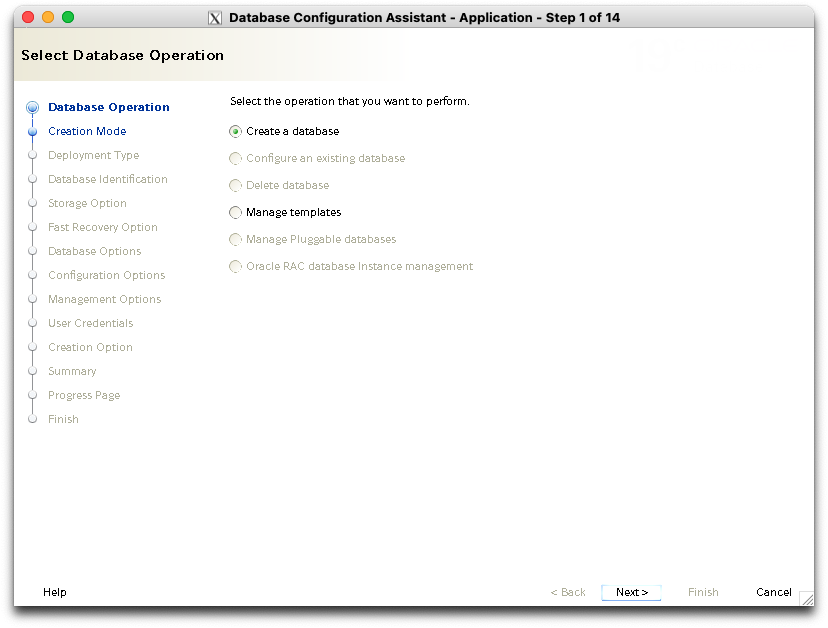
* 메모리 설정을 해야 해서 고급 설정으로 간다. Advanced configuration 선택   
 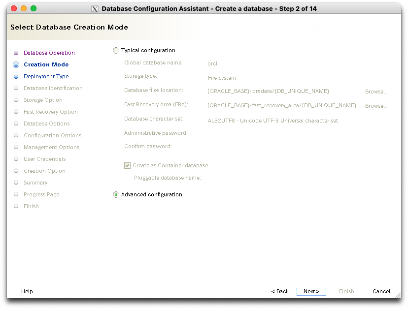
* 범용/트랜잭션 처리용. 기본 대로 선택함   
 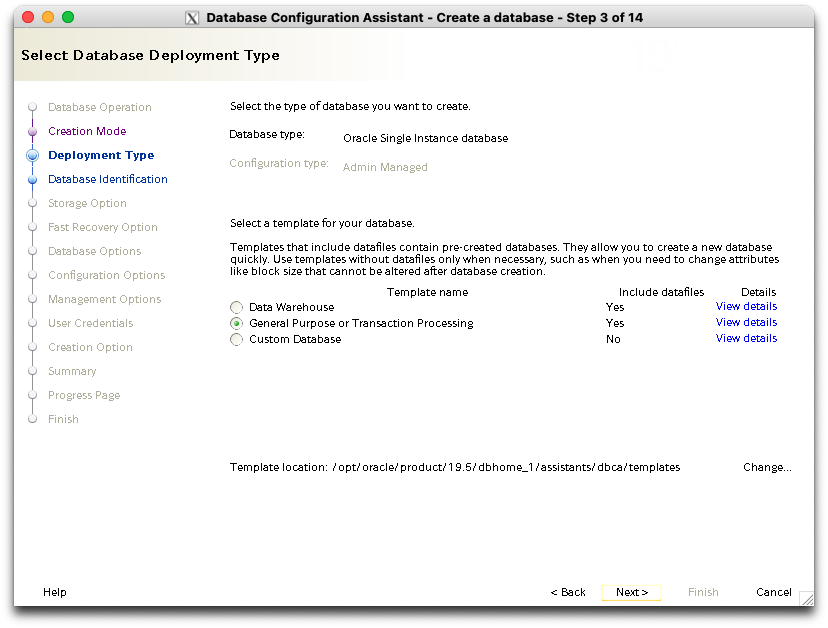
* 컨테이너 DB여부 선택. Create as container database 선택   
 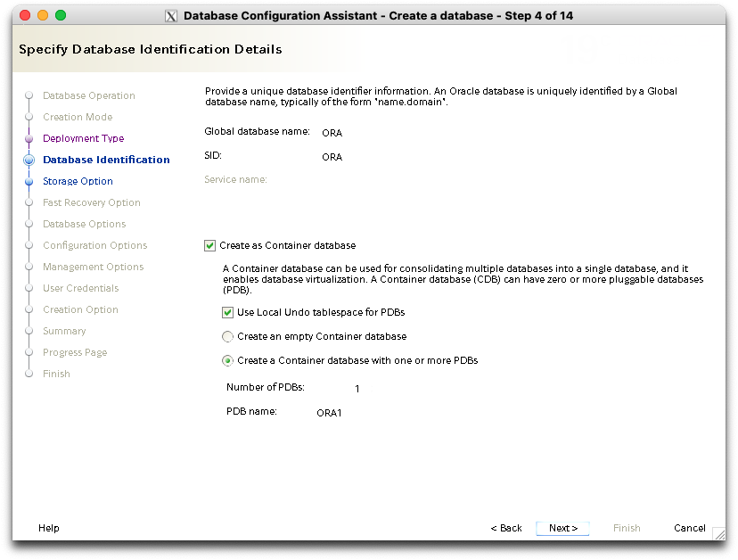
* 저장 방식 디렉토리 설정. 기본 대로 `$ORACLE_BASE/oradata` 로 설정   
 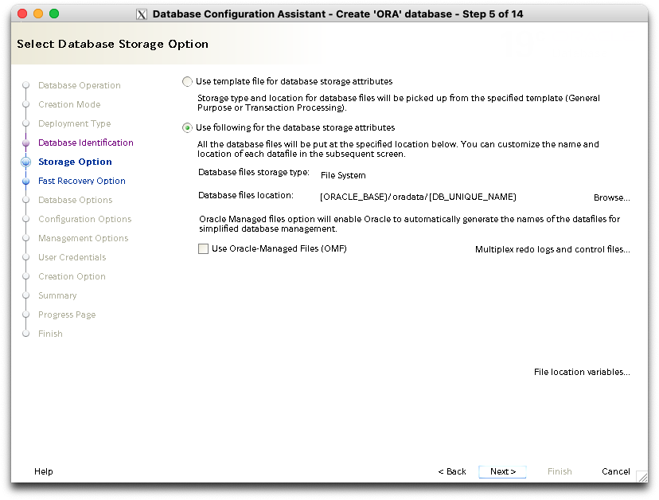
* 복구 데이터 디렉토리 설정. 기본 대로 `$ORACLE_BASE/fast_recovery_area` 로 설정   
 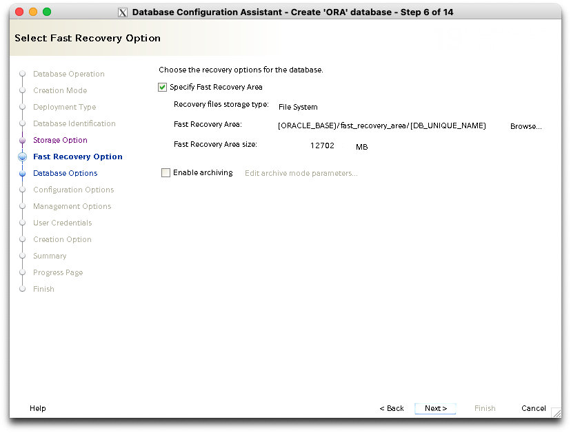
* 리스너는 조금 전 생성한 리스너가 자동 선택되어 있다.   
 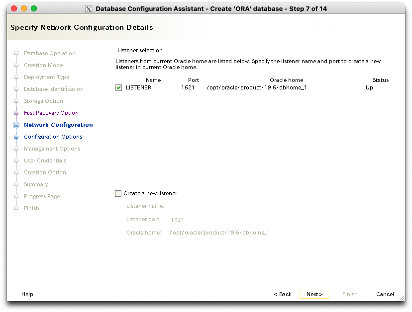
* Data Vault는 보안 관련 제품인데 스킵한다.   
 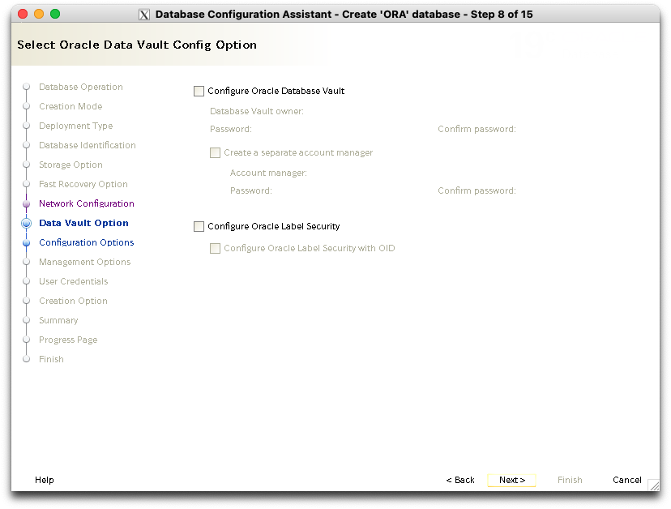
* 메모리 설정. 슬라이더를 조정하여 3072/2 = 1536로 설정한다   
 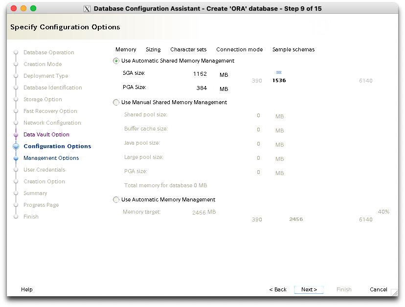
* 캐릭터셋은 반드시 AL32UTF8로 설정한다. 언어는 취향 대로   
 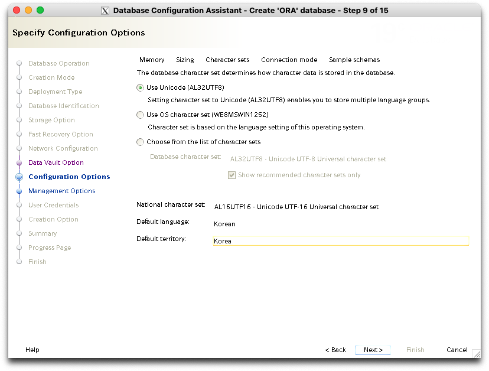
* 메모리가 많지 않으므로 shared server 모드를 선택   
 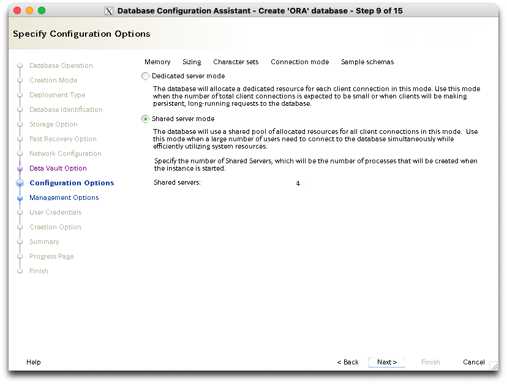
* 학습/테스트용이므로 샘플 스키마 설치   
 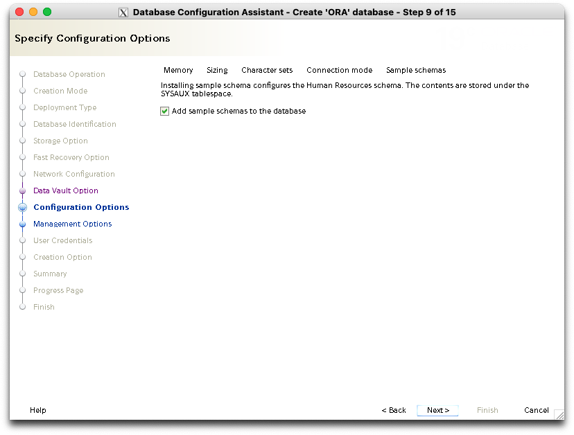
* Enterprise Manager(Web UI)는 사용이 불편한 편이며 메모리도 많지 않으므로 사용하지 않는다.   
 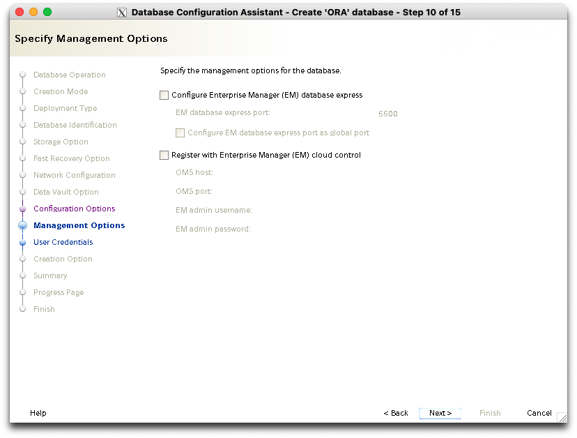
* 시스템 계정 비빌번호는 모두 동일하게 설정한다.   
 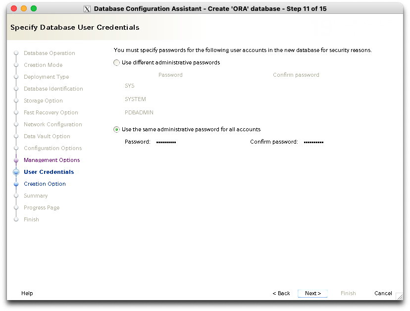
* 데이터베이스를 생성하고 동시에 나중에 참고할 수 있게 스크립트를 생성하도록 한다.   
 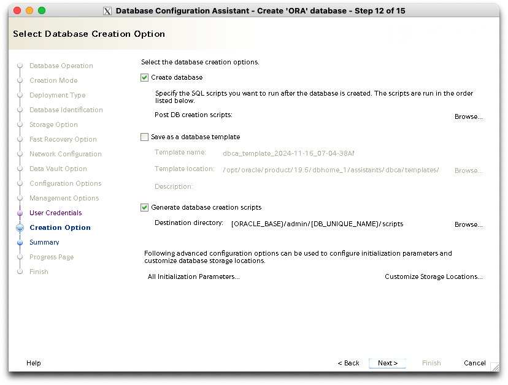
* 생성 준비 완료   
 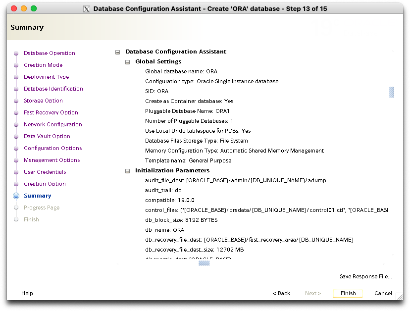
* 생성 진행중. 매우 오래 걸린다.   
 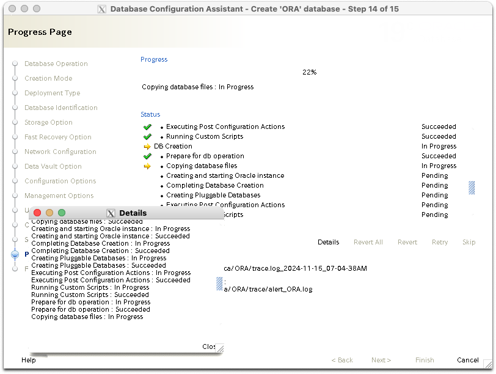
* 생성 완료   
 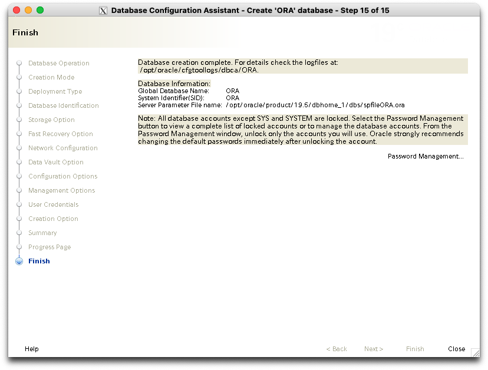
