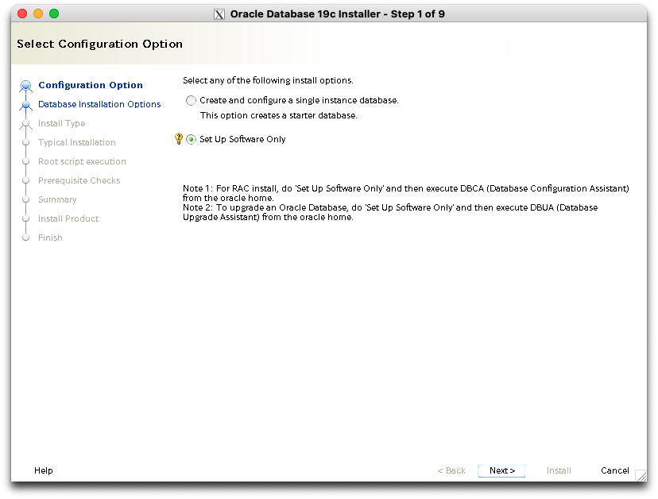

# Oracle Database 19c 설치

## Universal Installer 실행

* Setup Software Only 선택   
 
* Single instance 선택   
 
* Enterprise Edition 선택   
 
* `$ORACE_BASE`=`/opt/oracle` 변수에 따라서 기본 입력됨   
 
* `oraInventory`=`/etc/oracle/oraInventory` 직접 입력 필요함   
 
* 모두 `dba`가 자동 선택되는데 OSOPER 그룹은 수동 입력 필요   
 
* `root` 권한 실행 방법 선택 - `sudo` 가능한 사용자 계정 입력한다   
 
* 요구사항 검사 결과 swap 공간이 부족하다고 나오는데, 3 GiB 기준으로 운영할 것이므로 맞는 설정임. Ignore All 체크하고 다음 선택   
 
* 정말 맞는지 한번 더 물어봄. yes 선택    
 
* 설치 계획 리뷰   
 
* 설치 진행중 화면   
 
* `root` 권한 스크립트 실행 여부 확인. Yes 선택   
 
* 설치 완료 화면   
 
