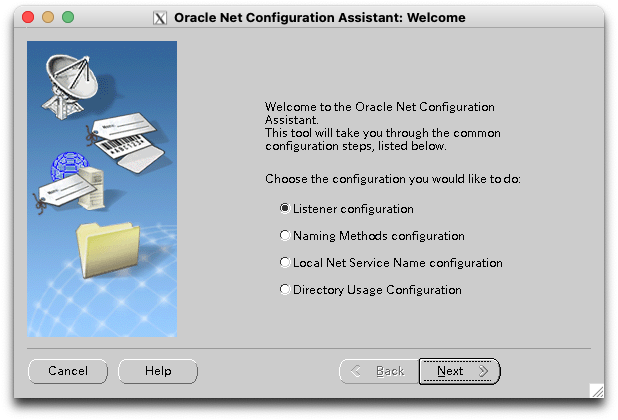
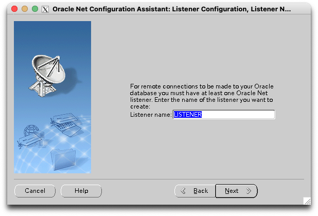
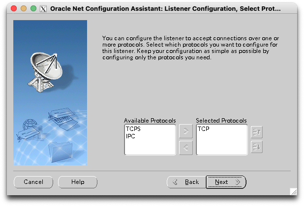
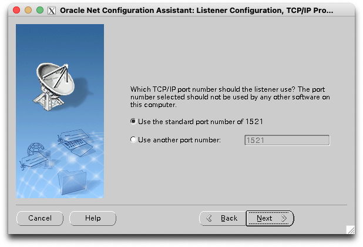
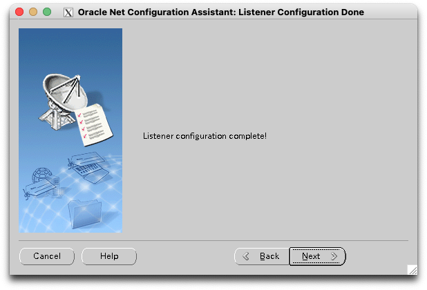
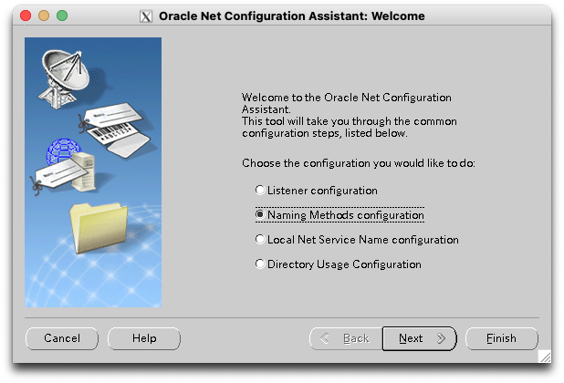
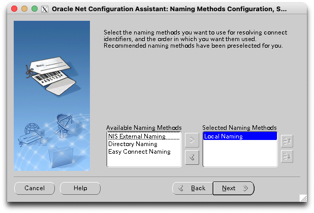
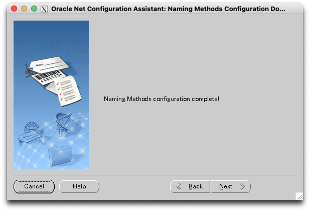

# Oracle Database 19c 설치

## Listener 생성

* Listener Configuration 선택   
 
* Add 선택   
 
* Listener 이름 선택 - 기본 LISTENER로 함   
 
* 접속 방식 선택 - 기본대로 TCP 선택    
 
* 포트 선택 - 기본대로 1521 선택   
 
* 더 설정 안함 선택   
 
* Listener 완료   
 
* Naming method 선택   
 
* Naming method 선택 - Local Naming 을 추가   
 
* Naming method 완료    
 
